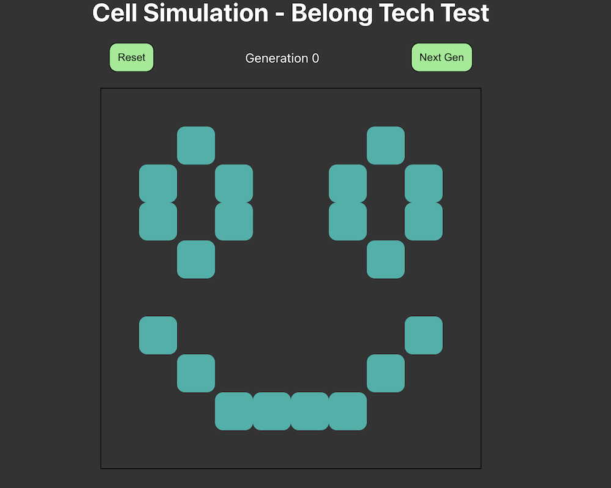
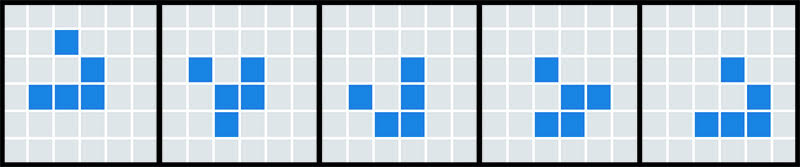
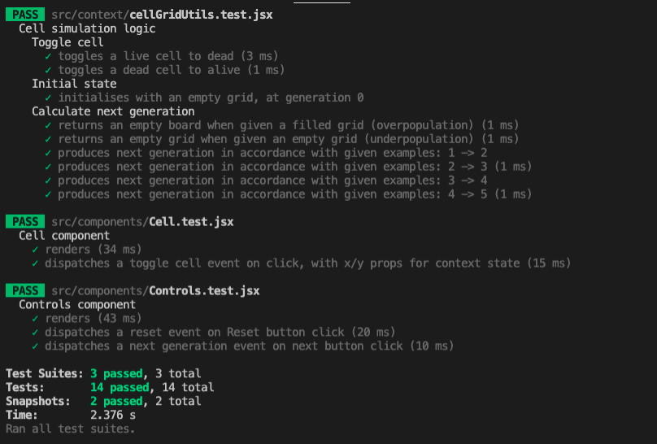

# Belong - Tech Test - Cell Simulation

# Table of Contents



## Test brief - Cell Simulator

The aim is to demonstrate how you approach thinking about problems and translating them to code.

Create a repository to your own, spend your allocated time working on a solution and then submit it back to us. Please include a README with installation and usage instructions.

Challenge: Cell Simulator

The "game" is a zero-player game, meaning that its evolution is determined by its initial state, requiring no further input. One interacts with the Cell Simulator by creating an initial configuration and observing how it evolves.

### Acceptance criteria

- [x] At initial state, User should see an empty board.
- [x] User can make Cells "alive".
- [x] User can make Cells "dead".
- [x] User can trigger "next generation".
- [x] User can trigger a "reset" to the initial state.

### Next generation

When the next generation is running:
A Cell with fewer than two live neighbours dies of under-population.
A Cell with 2 or 3 live neighbours lives on to the next generation.
A Cell with more than 3 live neighbours dies of overcrowding.
An empty Cell with exactly 3 live neighbours "comes to life".
A Cell who "comes to life" outside the board should wrap at the other side of the board.
Once the next generation is done, User can trigger "next generation" again.
This example shows an initial state followed by 4 "next generations"


### Requirements

Use React and TypeScript.
Please include some attempt at testing your code.
While not mandatory, a meaningful git history will be looked upon favourably.

---

<br>
  
## Installation

After cloning the project, install dependencies by running

```
npm install
```

or

```
yarn install
```

from the root directory, depending on your package manager.

---

## Running

Once dependencies are installed the project can be run with `npm start` or `yarn start`. It will start up at [localhost](http://localhost:3000).

---

## Usage

There are a few user interactions available.

- Cells: Click to toggle "alive" or "dead"
- Next gen: Runs the simulation and produces the next state of every cell
- Reset: Resets the grid to the intial empty state.

---

## Tests

I have written tests for the most important parts of the project, around the interactive components and business logic. This includes a test that specifically runs over the example scenario given.  
To run the test suites, use `npm test` or `yarn test`.


---

## Tools

This project was built in React using the Create React App to bootstrap.
You can learn more in the [Create React App documentation](https://facebook.github.io/create-react-app/docs/getting-started).

I also utilised Styled Components lib as I noticed it listed in the Belong position description. :)
